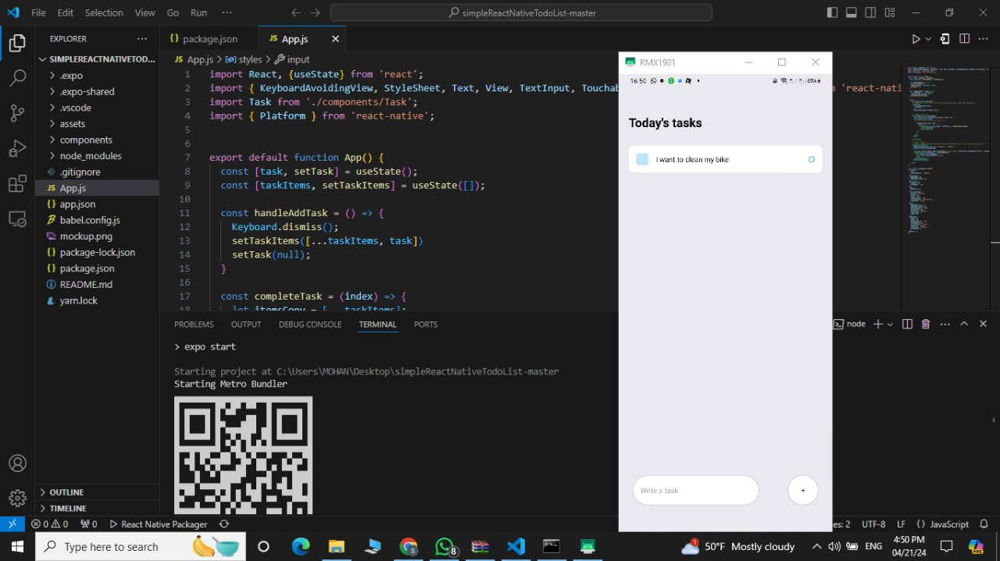

Step 1: Ensure that you have Node.js and npm installed on your computer to kickstart the development process. After that, install the React Native CLI globally by executing the command `npm install -g react-native-cli`. Once the CLI is set up, create a new React Native project named TodoApp by running `react-native init TodoApp`.

Step 2: Navigate to the directory where your newly created React Native project resides.

Step 3: Install necessary dependencies for your project using npm. These dependencies include packages like @react-navigation/native and @react-navigation/stack, which are essential for setting up navigation in your app.

Step 4: Link the installed dependencies, particularly for Android, to ensure that all necessary configurations are properly set up. Use the command `npx react-native link @react-native-community/masked-view` for this purpose.

Step 5: Create navigation for your app. This involves setting up navigation containers and defining stack navigators to manage the flow between different screens or components within your application.

Step 6: Begin creating the various screens that your app will consist of, such as the Home Screen and the Add Task Screen. These screens will serve as the primary interfaces for users to interact with your app.

Step 7: Start implementing the Home Screen of your to-do list app. This screen typically displays the list of tasks that users have added, allowing them to view and manage their to-do items.

Step 8: Proceed with implementing the Add Task Screen, where users can input new tasks to be added to their to-do list. This screen usually includes input fields and buttons for users to enter task details and confirm their addition.

Step 10: Test your app to ensure that it functions as expected. You can do this by running your app on an emulator, simulator, or physical device, depending on your development setup.

Step 11: Implement the logic for managing tasks within your app. This includes functionalities like adding new tasks, deleting existing tasks, and possibly updating task details. Ensure that these functionalities are properly implemented and tested for reliability and usability.

Screenshot:

